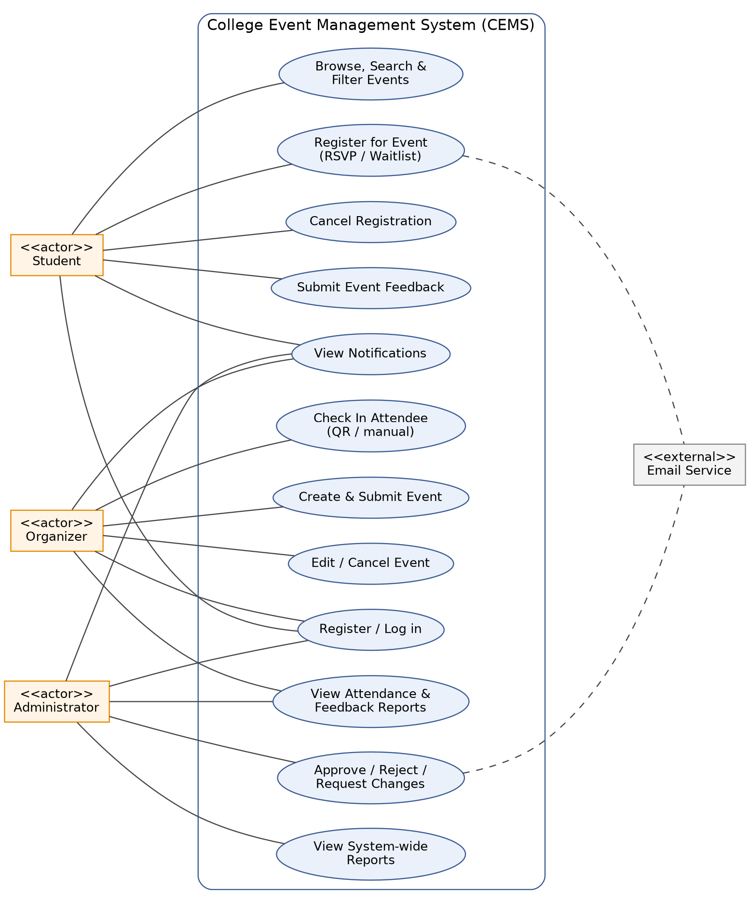

# **Software Requirements Specification** 

## **College Event Management System** 

Team 15 

_Tech Stack: JavaScript (MERN Stack) / Python (Django)_ 

|**SRN**|**Name**|
|---|---|
|PES1UG24CS576|Leesha R|
|PES1UG24CS593|Prajwal Manjunath Hegde|
|PES1UG24CS570|G Purvi|
|PES1UG24CS559|Ashith Rao K|

## Document Control 

|**Document Title**|Software Requirements Specification – College Event Management System|
|---|---|
|**Version**|1.1|
|**Team**|Team 15|
|**Date**|01 October 2026|

## Revision History

| Version | Date | Author | Change Summary |
| --- | --- | --- | --- |
| 1.0 | 10 September 2026 | Team 15 | Initial draft |
| 1.1 | 01 October 2026 | Team 15 | Added UML use case diagram; added Security Objectives and Requirements (§3.3); numbered all functional requirements as sub-items for measurability; added NFR IDs; resolved open items raised by the SAD review (lockout duration, password policy, check-in window, material-edit re-approval, waitlist promotion, audit log, department field, feedback visibility) by folding them into the relevant FRs; corrected internal inconsistencies (§1.5 section reference, FR-02 wording, FR-06 "Volunteer" role, Admin user-management claim in §2.3) |

## Table of Contents 

1. Introduction 

- 1.1 Purpose 

- 1.2 Scope 

- 1.3 Definitions, Acronyms and Abbreviations 

- 1.4 References 

- 1.5 Overview 

2. Overall Description 

- 2.1 Product Perspective 

- 2.2 Product Functions (Summary) 

- 2.3 User Classes and Characteristics 

- 2.4 Operating Environment 

- 2.5 Design and Implementation Constraints 

- 2.6 Assumptions and Dependencies 

3. Specific Requirements 

- 3.1 Functional Requirements (FR-01 to FR-08) 

- 3.2 Non-Functional Requirements 

- 3.3 Security Objectives and Requirements 

4. External Interface Requirements 

5. Key Use Cases 

- 5.1 Use Case Diagram 

- 5.2 Use Case Descriptions 

6. Appendix: Team 15 Members 

## 1. Introduction 

### 1.1 Purpose 

This Software Requirements Specification (SRS) document describes the functional and non-functional requirements for the College Event Management System (CEMS). It is intended for use by the development team, project evaluators, and future maintainers to understand the scope, features, and constraints of the system before design and implementation begin. 

### 1.2 Scope 

CEMS is a web-based application that allows a college to manage the full lifecycle of campus events — from creation and approval, through student discovery and registration, to attendance tracking and post-event feedback. The system supports three roles: Student, Event Organizer (faculty/club representative), and Administrator. It will be built using the MERN stack (MongoDB, Express, React, Node.js) and/or Python (Django) for the backend, as decided during the design phase. 

### 1.3 Definitions, Acronyms and Abbreviations 

|**Term**|**Definition**|
|---|---|
|CEMS|College Event Management System|
|SRS|Software Requirements Specification|
|FR|Functional Requirement|
|NFR|Non-Functional Requirement|
|JWT|JSON Web Token|
|RSVP|Répondez s'il vous plaît (event registration response)|
|QR Code|Quick Response Code, used for attendance check-in|
|Admin|College-level Administrator with approval authority|
|Organizer|Faculty member or club representative who creates events|
|RBAC|Role-Based Access Control|
|TLS|Transport Layer Security|

### 1.4 References 

- IEEE Std 830-1998, Recommended Practice for Software Requirements Specifications 

- Project Test Plan Document – Team 15 

- Team 15 Project Charter / Problem Statement 

- Software Architecture and Design Specification – Team 15, v1.0 

### 1.5 Overview 

The remainder of this document is organized as follows: Section 2 gives an overall description of the product, including the assumptions and dependencies in §2.6; Section 3 lists detailed functional and non-functional requirements, including the security objectives and requirements in §3.3; Section 4 describes external interface requirements; Section 5 presents the key use cases together with a UML use case diagram; and Section 6 lists the Team 15 members. 

## 2. Overall Description 

### 2.1 Product Perspective 

CEMS is a new, standalone web application. It is not a modification of an existing system. It will integrate with the college's email service (for notifications) and may optionally integrate with an SSO/college ID system in a future release. 

### 2.2 Product Functions (Summary) 

- User Registration and Authentication 

- Event Creation and Management 

- Event Approval Workflow 

- Event Browsing, Search and Filtering 

- Event Registration / RSVP 

- Attendance Tracking (QR Check-in) 

- Notification System 

- Feedback and Rating System 

### 2.3 User Classes and Characteristics 

|**User Class**|**Characteristics**|
|---|---|
|**Student**|Browses events, registers/RSVPs, receives notifications, and submits feedback. No technical expertise assumed.|
|**Organizer**|Faculty or club representative who creates, edits, and manages events, and marks attendance. Comfortable with basic web forms.|
|**Administrator**|Approves/rejects events, maintains an audit log of approval decisions, and views system-wide attendance and feedback reports. Has the highest privilege level. Admin accounts are pre-provisioned (see FR-01); CEMS v1 does not provide a general user-management UI.|

### 2.4 Operating Environment 

Server-side: Node.js/Express (MERN) or Django (Python), with MongoDB or PostgreSQL as the database. Clientside: a responsive web front end (React) accessible via modern desktop and mobile browsers over HTTPS. 

### 2.5 Design and Implementation Constraints 

- Must be delivered using the JavaScript (MERN) stack and/or Python (Django), as assigned to Team 15. 

- Must be completed within the academic semester project timeline. 

- Must run within the college's approved hosting/infrastructure environment. 

### 2.6 Assumptions and Dependencies 

- Users have access to a college-issued or personal email address for registration and notifications. 

- Event venues and their capacities are known and entered manually by Organizers (no live facility-booking integration in v1). 

- Payment gateway integration for paid events is out of scope for the initial release. 

## 3. Specific Requirements 

### 3.1 Functional Requirements 

#### FR-01: User Registration and Authentication 

The system shall allow Students, Event Organizers, and Administrators to register and log in using role-based credentials. 

- **FR-01.1** Users register with name, college email ID, password, and role (Student / Organizer). The system shall reject registration if the email is already in use or does not match a valid email format. 

- **FR-01.2** Passwords shall be at least 8 characters long and contain at least one letter and one digit, and shall be stored using a secure hashing algorithm (bcrypt). Plain-text passwords shall never be stored or logged. 

- **FR-01.3** Admin accounts are pre-provisioned by the college IT administrator and are not self-registered. 

- **FR-01.4** The system supports login, logout, forgot-password (single-use reset link valid for 30 minutes), and session/token-based authentication (JWT). 

- **FR-01.5** Invalid login attempts display a generic error message that does not reveal whether the email is registered; an account locks for 15 minutes after 5 consecutive failed attempts, after which login is automatically re-enabled. 

#### FR-02: Event Creation and Management 

The system shall allow Organizers to create, edit, and cancel college events with all relevant details. 

- **FR-02.1** Event fields: title, category, description, venue, department, date/time, capacity, banner image, and registration deadline. 

- **FR-02.2** Organizers can save an event as a draft before submitting for approval. 

- **FR-02.3** Organizers can edit or cancel events they own, subject to approval status. A material edit to an already-approved event (change of date/time, venue, or capacity) returns the event to "Pending Approval"; the event's last-approved details remain publicly visible until the Administrator decides on the edit. Cancelling an approved event removes it from public listings and notifies all registered students (see FR-07). 

- **FR-02.4** The system validates that the event date/time is in the future and that the venue is not double-booked against another approved event in an overlapping time slot. 

#### FR-03: Event Approval Workflow 

The system shall route every newly created or materially edited event to an Administrator for approval before it becomes publicly visible. 

- **FR-03.1** Admin can view a queue of pending events with full details. 

- **FR-03.2** Admin can Approve, Reject (with a mandatory reason), or Request Changes (with comments). 

- **FR-03.3** The Organizer receives a notification of the approval decision, including the reason or comments where applicable (see FR-07). 

- **FR-03.4** Rejected events, and events with changes requested, remain editable and re-submittable by the Organizer; re-submission returns the event to "Pending Approval". 

- **FR-03.5** Every approval decision (Approve, Reject, Request Changes) is recorded in an audit log with the deciding Administrator's identity, the event ID, and a timestamp. The audit log is visible to Administrators and cannot be edited or deleted through the application. 

#### FR-04: Event Browsing, Search and Filtering 

The system shall allow Students to browse, search, and filter approved events. 

- **FR-04.1** Search by keyword (title/description) and filter by category, date range, venue, and department. 

- **FR-04.2** Results are sortable by date and by popularity (registration count). 

- **FR-04.3** Each event has a detail page showing all event information and the number of remaining seats. 

#### FR-05: Event Registration / RSVP 

The system shall allow Students to register for an approved event before the registration deadline and while capacity remains available. 

- **FR-05.1** The system prevents registration once capacity is full and offers a "Join Waitlist" option instead. When a confirmed registrant cancels, the first student on the waitlist is automatically promoted to a confirmed registration and notified (see FR-07). 

- **FR-05.2** The system prevents duplicate registration by the same student for the same event. 

- **FR-05.3** A confirmation (with a unique registration code and QR code) is generated on successful registration. 

- **FR-05.4** Students can view and cancel their own upcoming registrations; cancelling releases the seat. 

#### FR-06: Attendance Tracking (QR Check-in) 

The system shall allow Organizers to mark attendance at the event venue using the registration QR code, from the event's scheduled start time until its scheduled end time. 

- **FR-06.1** The Organizer scans or manually enters the registration code to mark a student present. Manual entry is provided as a fallback when a camera/scanner is unavailable. 

- **FR-06.2** The system rejects an already-used, invalid, or out-of-window (before start or after end) registration code with a clear, specific error message. 

- **FR-06.3** Attendance data is available in real time to the Organizer and Admin dashboards. 

#### FR-07: Notification System 

The system shall notify users of key events via email and in-app notifications. 

- **FR-07.1** Notifications are sent for: registration confirmation, event approval/rejection/changes-requested, event updates or cancellation, waitlist promotion, and reminders 24 hours before the event. 

- **FR-07.2** Users can view a notification history within the application, in reverse chronological order. 

- **FR-07.3** Email delivery failures are logged and do not block the underlying action; the corresponding in-app notification is still created. 

#### FR-08: Feedback and Rating System 

The system shall allow Students who attended an event to submit a rating and feedback after the event concludes. 

- **FR-08.1** The feedback form becomes available only after the event's scheduled end time, and only to students marked "Present" for that event (see FR-06). 

- **FR-08.2** Rating is on a 1–5 scale with an optional text comment. A student may submit feedback for a given event once; a second attempt shows their existing submission in read-only mode. 

- **FR-08.3** Organizers and Admin can view the aggregated rating and the list of comments per event. Comments are shown without revealing which student submitted them. 

### 3.2 Non-Functional Requirements 

|**ID**|**Category**|**Requirement**|
|---|---|---|
|**NFR-01**|**Performance**|The system shall load the event listing page within 3 seconds under normal load (up to 200 concurrent users) and process a registration request within 2 seconds.|
|**NFR-02**|**Security**|All communication shall use HTTPS/TLS 1.2 or higher. Passwords shall be hashed (never stored in plain text). Role-based access control shall restrict Admin/Organizer-only functions from Students. See §3.3 for detailed security objectives and requirements.|
|**NFR-03**|**Usability**|The interface shall be responsive (desktop, tablet, mobile) and usable by a first-time user without training, following standard web accessibility guidelines (WCAG 2.1 AA where feasible).|
|**NFR-04**|**Reliability / Availability**|The system shall be available 99% of the time during active college semesters, with automated daily database backups and a documented restore procedure.|
|**NFR-05**|**Scalability**|The system architecture shall support horizontal scaling of the application server to accommodate peak registration periods (e.g., fest season).|
|**NFR-06**|**Maintainability**|The codebase shall follow a modular MVC structure with documented REST APIs to allow independent maintenance of frontend and backend.|
|**NFR-07**|**Portability**|The web application shall function correctly on the latest two major versions of Chrome, Firefox, Edge, and Safari.|

### 3.3 Security Objectives and Requirements 

#### Security Objectives 

|**ID**|**Objective**|
|---|---|
|**SO-1**|**Confidentiality** — protect user credentials and personal data (name, email, registration and attendance history) from unauthorized access or disclosure.|
|**SO-2**|**Integrity** — ensure that events, registrations, attendance records, and approval decisions cannot be tampered with by a user who is not authorized to change them.|
|**SO-3**|**Availability** — keep the system usable during peak load (e.g., fest registration) and resistant to common denial-of-service patterns such as request flooding.|
|**SO-4**|**Accountability** — maintain a reliable, tamper-evident record of privileged actions (approval decisions, check-ins) so that actions can be traced to the responsible user.|

#### Security Requirements 

|**ID**|**Requirement**|
|---|---|
|**SEC-01**|All client–server communication shall occur over HTTPS using TLS 1.2 or higher; plain HTTP requests shall be redirected to HTTPS.|
|**SEC-02**|Passwords shall be stored only as salted cryptographic hashes (bcrypt); the system shall never log, display, or transmit a password or password hash after the initial submission.|
|**SEC-03**|The system shall enforce role-based access control on every protected page and API endpoint, so that a Student cannot perform Organizer- or Admin-only actions and an Organizer cannot manage another Organizer's events.|
|**SEC-04**|The system shall lock an account for 15 minutes after 5 consecutive failed login attempts (see FR-01.5) and shall rate-limit authentication endpoints to resist credential-stuffing and brute-force attacks.|
|**SEC-05**|Session tokens (JWT) shall be transmitted and stored only in an httpOnly, Secure, SameSite cookie, shall expire after a bounded session lifetime, and shall be rejected by the server if altered, expired, or unsigned.|
|**SEC-06**|The system shall validate and sanitize all user input on the server side to prevent injection attacks (e.g., NoSQL operator injection) and cross-site scripting (XSS) in event descriptions, titles, and feedback comments.|
|**SEC-07**|Registration/QR codes shall be unique, unguessable (not sequential), and single-use; a code shall be rejected if reused, expired, or presented for an event other than the one it was issued for.|
|**SEC-08**|All Administrator approval decisions and attendance check-ins shall be recorded in an append-only audit log containing the actor, action, affected entity, and timestamp (see FR-03.5).|

## 4. External Interface Requirements 

- 4.1 User Interfaces 

   - Responsive web UI with distinct dashboards for Student, Organizer, and Admin roles. 

   - Event listing page, event detail page, registration/QR confirmation screen, and feedback form. 

### 4.2 Hardware Interfaces 

None beyond a standard device with a camera/scanner (optional) for QR-based check-in; manual code entry is provided as a fallback. 

- 4.3 Software Interfaces 

   - Email/SMTP service (e.g., SendGrid or Nodemailer) for notifications. 

   - Database: MongoDB (MERN) or PostgreSQL (Django). 

### 4.4 Communication Interfaces 

All client–server communication occurs over HTTPS using a RESTful JSON API. 

## 5. Key Use Cases 

### 5.1 Use Case Diagram 

The diagram below shows the three actors (Student, Organizer, Administrator), the external Email Service, and their use cases, including the ones summarized in the table in §5.2.

*Figure 1: CEMS UML use case diagram.*

### 5.2 Use Case Descriptions 

|**ID**|**Use Case**|**Actor**|**Description**|
|---|---|---|---|
|UC-01|**Register for an Event**|Student|Student browses events, selects one, and registers before the deadline/capacity limit.|
|UC-02|**Create and Submit an** **Event**|Organizer|Organizer fills event details and submits for Admin approval.|
|UC-03|**Approve/Reject an** **Event**|Administrator|Admin reviews a pending event and approves or rejects it with a reason.|
|UC-04|**Check In Attendee**|Organizer|Organizer scans/enters a student's registration code to mark attendance at the venue.|
|UC-05|**Submit Event Feedback**|Student|Attended student rates the event and leaves a comment after it ends.|

## 6. Appendix: Team 15 Members 

||**SRN**|**Name**|
|---|---|---|
|PES1UG24CS576||Leesha R|
|PES1UG24CS593||Prajwal Manjunath Hegde|

||**SRN**||**Name**|
|---|---|---|---|
|PES1UG24CS570||G Purvi||
|PES1UG24CS559||Ashith Rao K||

